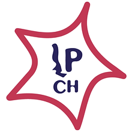

# Bases Thinkathon

## Descripción del concurso

La Makerthon 2023 es un concurso que busca promover la innovación con enfoque humanitario. A través de un llamado abierto a la comunidad UC, el concurso pretende que surjan soluciones creativas a un problema real, dentro de un entretenido ambiente competitivo.

## Etapas del concurso

### Etapa 0: Inscripción

La inscripción al concurso se realizará mediante un form que será oportunamente difundido en redes sociales de Ingeniería Para Chile (IPCH).

Los requisitos de inscripción son los siguientes:

- Ser estudiante de la Pontificia Universidad Católica de Chile. Se aceptarán estudiantes de pre y postgrado, de cualquier carrera.
- La inscripción será en grupos de hasta 4 personas. Sólo quien lidere el grupo deberá responder el form. 
- Se permite ser sólo 1 persona, que luego sera unido a un grupo al azar.

### Etapa 1: Lanzamiento

El día [FECHA POR CONFIRMAR] se realizará el lanzamiento del concurso, de manera presencial en [LUGAR POR CONFIRMAR]. Este consistirá de una presentación de la problemática que durará 15 minutos, seguido de 5 minutos de preguntas.

Luego, se planteará el desafío específico que se tendrá que abordar en el concurso. Se quedará proyectado el desafío y se dará espacio a que los grupos comiencen a discutir sus ideas.

En un plazo de [50] minutos, cada grupo elaborará una propuesta de solución. Para ello tendrán que investigar factibilidad y elaborar un mock-up que ilustre su idea. Este mock-up podrá ser de cualquier tipo, desde un dibujo hasta un modelo 3D. Lo importante es que refleje claramente cómo solucionaría el problema, sus componentes y los detalles que consideren relevantes de su solución.

Al final de esta etapa, cada grupo deberá enviar su mock-up y una breve descripción de la solución. Para esto, se habilitará un correo que será oportunamente comunicado, donde podrán enviar un pdf con la explicación y una foto o el archivo en el que hayan diseñado el mock-up.

El jurado se encargará de evaluar las propuestas y serán seleccionadas las (10) mejores para avanzar a la siguiente fase.

### Etapa 2: MakerTank

Los grupos seleccionados serán convocados a exponer sus ideas frente al jurado. Cada grupo tendrá un espacio máximo de 5 minutos para exponer, sumado a (2) minutos de preguntas. 

El jurado decidirá en base a una rúbrica y su criterio personal qué grupos son los ganadores. Se premiará a los (3) mejores grupos.

## Objetivos y Temas

### Objetivos

- Solucionar de forma innovadora problemáticas sociales. 
- Estimular la interdisciplina.
- Conectar al estudiantado con problemáticas y desafíos reales.

### Temas

- Problemas de acceso asociados a la crecida del rio en la comunidad de Rinconada de Idahue, Coltauco.
- 1.Gobernanza:  Burocracia y gestión de emergencias. *POR CONFIRMAR*

  1.1 Propuesta integral para la gestión y coordinación de ayudas en la recuperación de la emergencia: Posterior a la respuesta in situ de una emergencia, se debe comenzar la fase de recuperación, rehabilitando y reparando las condiciones básicas de vida. En esta etapa, las zonas afectadas reciben ayuda material en enceres, ropas, muebles, además de la llegada de voluntarios, lo que requiere de una logística de alimentación y alojamiento, entre otras cosas. Para esto, se solicita realizar una propuesta de instrumento que permita planificar y gestionar ayudas, mediante el análisis de posibles albergues comunitarios, puntos de almacenamiento y acopios, logística con voluntariados, entre otros aspectos

  2.2 Apoyo a la Secretaría Comunal de Planificación (SECPLA) en la cartera de proyectos para la mitigación de Riesgos de Desastres
Con miras a la prevención de futuros riesgos de desastres, se requieren estudiantes que puedan apoyar a la Secretaría de Planificación Ambiental en la generación y mejoramiento de proyectos de infraestructura para mitigar el riesgo y consecuencias de inundaciones.

## Colaboración con Organizaciones Públicas

En esta ocasión, se está trabajando con:

- Centro de Alumnos de Ingeniería (CAI)
- Dirección de Compromiso Público, Comunidad y Diversidad (DcDi)

## Criterios de Evaluación

El jurado estará compuesto por un panel de 3 personas:

- Miembro de la organización que entregó la problemática
- Profesor/a ligado/a al área del desafío
- Miembro de la comisión Maker de Ingeniería para Chile

Las rúbricas a utilizar serán las siguientes:

### Rúbrica Etapa 1:

### Rúbrica Etapa 2:

## Premios y Reconocimientos

Los premios a entregar son los siguientes:

- 1er lugar: 
- 2do lugar:
- 3er lugar:
- Resto de los seleccionados Etapa 2:
- Participantes: 

## Calendario

- La publicación de los formularios de inscripción será el (), mientras que el cierre de postulaciones será el ().
- El lanzamiento se realizará el día ().
- Los resultados de los 10 primeros seleccionados serán entregados el ().
- El MakerTank será el día (). Los grupos ganadores se anunciarán al final del evento.

## Propiedad Intelectual

Cada grupo tendrá la posibilidad de continuar con su proyecto si así lo desea. Al mismo tiempo, las ideas presentadas serán exclusivamente de su propia autoría.

## Reglas varias

## Anexos

- Formularios de inscripción.
- Documentos de colaboración con las organizaciones públicas.
- Cualquier otro documento relevante.

